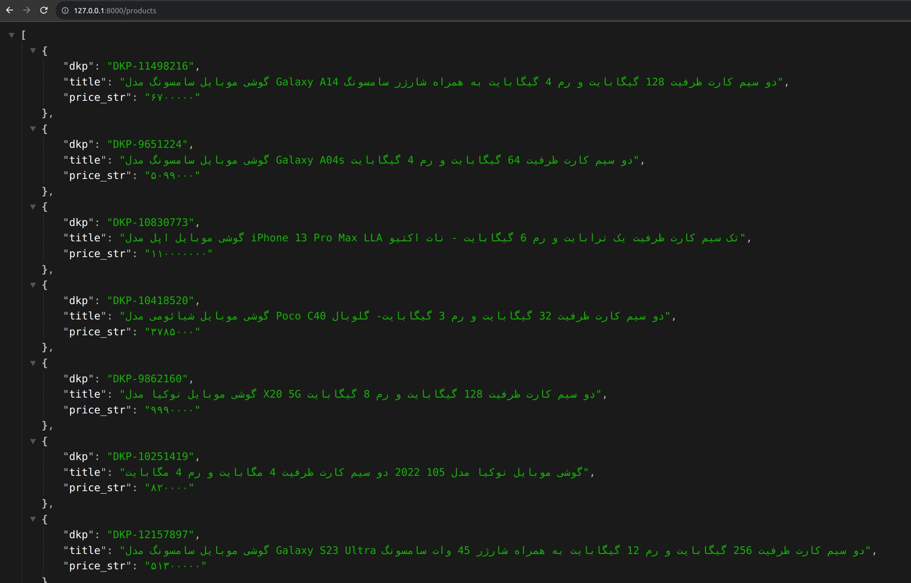
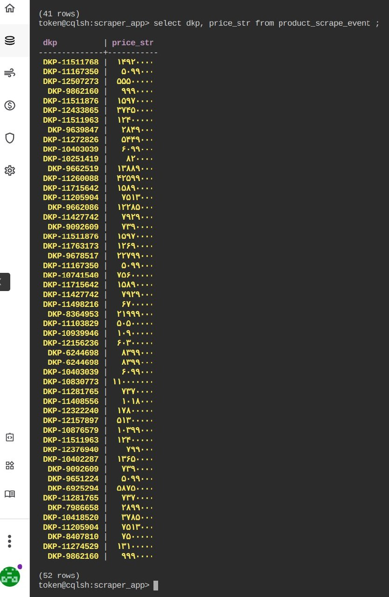

# DigiPulse
[](https://github.com/AmirAflak/DigiPulse/blob/main/LICENSE)
[](https://www.python.org/downloads/)
[](https://pypi.org/project/cassandra-driver/)
[](https://pypi.org/project/celery/)
[](https://pypi.org/project/fastapi/)
[](https://pypi.org/project/pydantic/)
[](https://pypi.org/project/selenium/)

## Description
Digipulse is a Python project designed to crawl products from the [Digikala](https://www.digikala.com) and track their prices and other characteristics. It utilizes Selenium for crawling, Redis as a queuing system for scraping tasks, CassandraDB (DataStax Cloud) for storing JSON data, and FastAPI to create a REST API for CRUD operations with the database.

The project enables you to efficiently collect and manage product data from Digikala, automating the process of tracking prices and other properties over time.

## Features
* Crawl products from the Digikala website.
* Track and monitor price changes and other characteristics of the products.
* Queue scraping tasks on Redis for efficient distribution to Celery workers.
* Store and manage JSON product data in CassandraDB on [DataStax Cloud](https://astra.datastax.com/).
* Expose a REST API built with FastAPI for CRUD operations on the database.
* Use Pydantic models for request and response validation in the FastAPI endpoints.

## Installation 
1. Clone the repo
   ```sh
   git clone https://github.com/AmirAflak/DigiPulse.git
   ```
2. Navigate into the project directory:
   ```sh
   cd DigiPulse
   ```
3. Set up a Python virtual environment:
   ```sh
   python3 -m venv .venv
   source .venv/bin/activate
   ```
4. Install the project dependencies:
   ```sh
   pip install -r requirements.txt
   ```
5. Configure the project:
* Edit config.py and adjust the necessary settings, such as database connection details and API configuration.
6. Run the application:
   ```sh
   uvicorn app.main:app --reload
   ```
   The API should now be accessible at http://localhost:8000.

  
## Usage
Once the application is running, you can use the exposed endpoints of the REST API to interact with the database and perform CRUD operations on the product data.

### Screenshots
These screenshots from the DigiPulse portray the successful implementation of real-time price tracking through API integration and the utilization of Cassandra's robust database capabilities.

* <b>REST API:</b> Implementation of the API for real-time price tracking in the DigiPulse. Through this functionality, users can list various products and keep track of their prices dynamically. The API integration enables seamless communication between the DigiPulse platform and external systems or databases to gather up-to-date pricing information. This real-time price tracking feature enriches the user experience by providing accurate and timely data on product prices, allowing users to make informed decisions.

<br />
<p align="center">
  <a href="[https://github.com/AmirAflak/DigiPulse">
    
  </a>
</p>
<br /> 

* <b>CQL Console:</b> Captures a table in the Cassandra database within the DigiPulse project, as viewed through the DataStax CQL console. Specifically, the table shown reflects the structured data stored in the Cassandra database, which supports the efficient management and retrieval of product-related information. Cassandra's distributed architecture and scalability make it a suitable choice for the DigiPulse project, ensuring reliable and high-performance data storage and retrieval. By utilizing the power of Cassandra, the project gains the ability to handle large volumes of data while maintaining system responsiveness and resilience.<br />
<br />
<p align="center">
  <a href="[https://github.com/AmirAflak/DigiPulse">
    
  </a>
</p>

<!-- CONTRIBUTING -->
## Contributing

Contributions are what make the open source community such an amazing place to learn, inspire, and create. Any contributions you make are **greatly appreciated**.

If you have a suggestion that would make this better, please fork the repo and create a pull request. You can also simply open an issue with the tag "enhancement".
Don't forget to give the project a star! Thanks again!

1. Fork the Project
2. Create your Feature Branch (`git checkout -b feature/AmazingFeature`)
3. Commit your Changes (`git commit -m 'Add some AmazingFeature'`)
4. Push to the Branch (`git push origin feature/AmazingFeature`)
5. Open a Pull Request

## License
This project is licensed under the MIT License. See the [LICENSE](https://github.com/AmirAflak/DigiPulse/blob/main/LICENSE) file for details.


